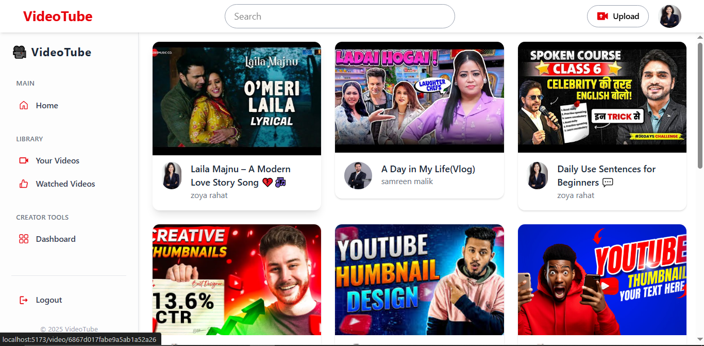
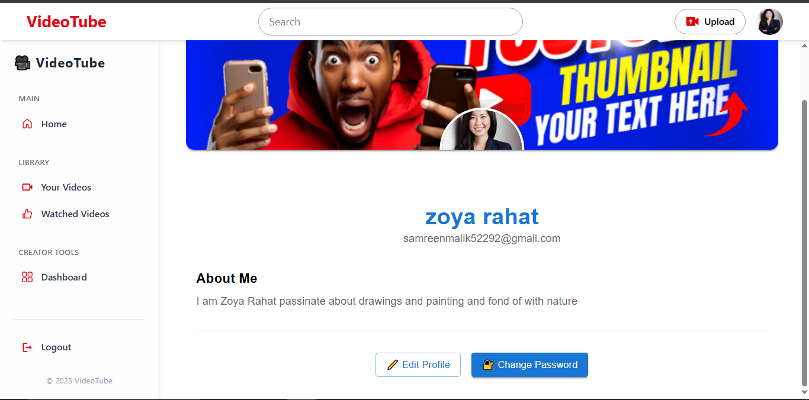
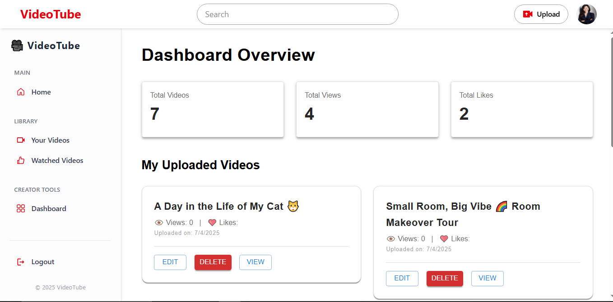
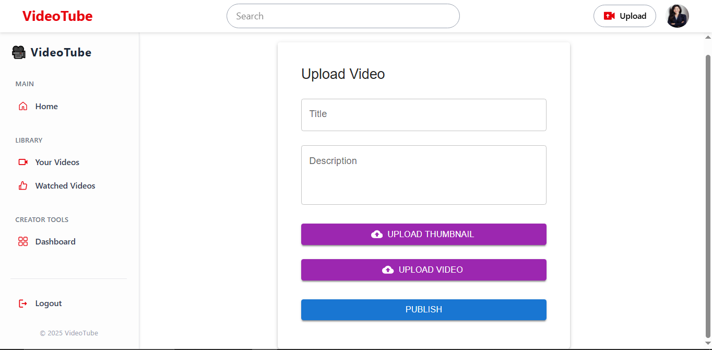
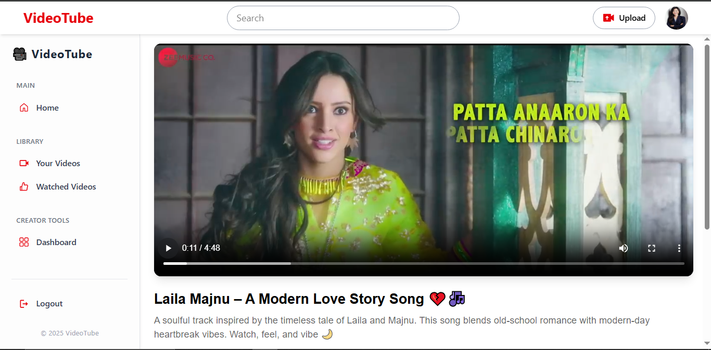
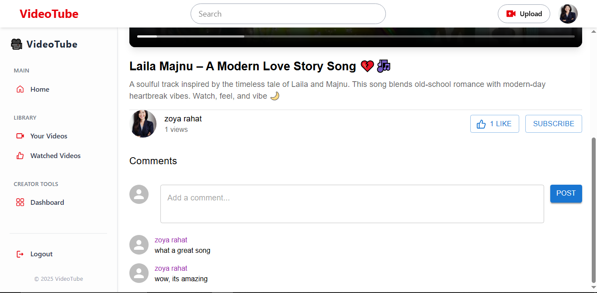
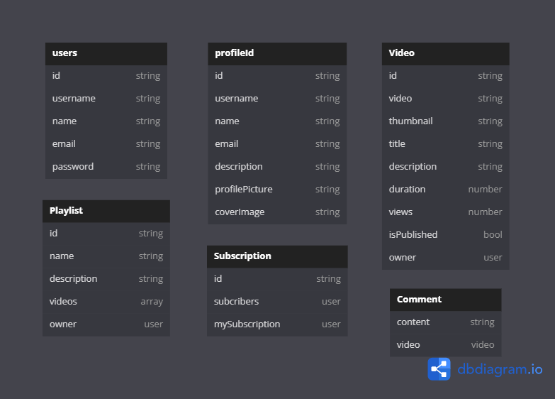

# VideoTube - A VideoSharing Plateform (MERN Stack)

## Overview

VideoTube is a full-stack video-sharing platform built using the MERN (MongoDB, Express, React, Node.js) stack. It allows users to upload, view, and interact with videos, similar to YouTube.

## Features

- User Authentication (Sign Up, Login, Logout, Email Verification)
- Video Uploading
- Like & Dislike Videos
- Commenting System
- User Profiles
- Search Functionality

---

---

---

---

---

---

## Tech Stack

- **Frontend**: React.js, Redux, Tailwind CSS
- **Backend**: Node.js, Express.js
- **Database**: MongoDB, Mongoose
- **Authentication**: JWT (JSON Web Token)
- **Storage**: Cloudinary (for video storage)

## Usage

1. Register/Login as a user.
2. Upload videos and manage your content.
3. Like, dislike, and comment on videos.
4. Get stats on dashboard

---

---

---

---

---

---

## DATABASE DESIGN

